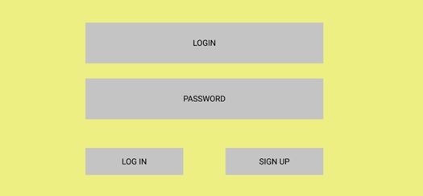
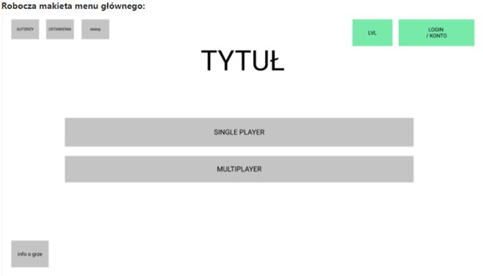
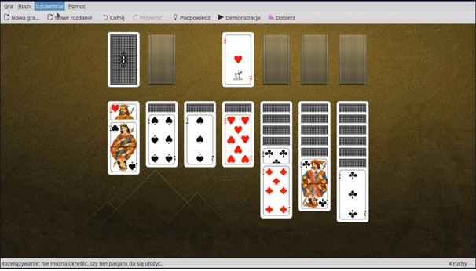

# Specyfikacja aplikacji

## Krótki opis

Aplikacje na wzór popularnej gry Pasjans Klondike. Głównym założeniem programu jest możliwość gry w popularnego Pasjansa oraz umożliwienie gry z innymi graczami przez Internet. Rozgrywka wieloosobowa ma polegać na rozgrywaniu tego samego rozdania w tym samym czasie z innymi graczami. W przeciwieństwie do rozgrywki jednoosobowej, która ma odbywać się na standardowych zasadach, w grze z innymi graczami punktacja oraz czas mają decydować o zwycięzcy rozdania. Aplikacja ma wbudowany system rankingowy, który podsumowuje aktualne osiągnięcia graczy, zdobyte podczas grania, oraz ustawia, według ustalonych kryteriów, ranking wszystkich użytkowników. Możemy w aplikacji zarejestrować swoje konto, a później zalogować do niego. Użytkownik, po zalogowaniu, ma do dyspozycji menu. Menu oferuje pozycje takie jak stworzenie nowej gry, ustawienia czy podgląd swojego profilu użytkownika. W zakładce z profilem możemy podejrzeć swoje dotychczasowe wyniki ze swoich rozgrywek oraz statystyki.

## Okno logowania/rejestracji

Okno logowania oraz rejestracji jest podstawowym formularzem rejestracyjnym.

## Okno po zalogowaniu

Menu główne ma zapewniać dostęp do innych widoków naszej aplikacji, jakimi są prezentacja profilu i statystyk gracza, tryby jednoosobowy i wieloosobowy, ustawienia oraz ogólne informacje o grze. Stanowi ono również widok główny aplikacji, stanowiący pierwszy bodziec, z jakim spotka się użytkownik, który otworzy aplikację w przeglądarce.

## Okno ustawień

W ustawieniach mamy możliwość operowania muzyką w tle, wyłączenia/włączenia/zmiany, oraz dodatkowo zmienienia motywu kart, którymi gramy. Oprócz podstawowych tali kart, mamy możliwość pobrania dodatkowych tali. Istnieje pomysł specjalnej oprawy graficznej kart, inspirowanej motywem SGGW.

## Okno profilu użytkownika połączone

W tym oknie mamy ogólne informacje o koncie użytkownika oraz jego statystyki. Na samej górze jest miejsce na wybór awatara w celu spersonalizowania profilu, a obok nasza nazwa użytkownika, opis, czas dołączenia gracza do platformy oraz kraj pochodzenia. Poniżej mamy szczegółowe statystyki gracza. Ilość gier wygranych, przegranych, remisów, średni czas skończenia rozdania, ranking użytkownika.

## Okno rankingów

Jest to spis pięćdziesięciu pierwszych graczy danego rankingu z możliwością przemieszczania się na kolejne strony. Na samej górze rankingu mamy do wyboru ustawienia sortowania rankingu według konkretnych kryteriów. Głównymi kryteriami są tryb gry oraz punkty rankingu, które otrzymujemy oraz tracimy na bieżąco podczas rozgrywek. Każdy gracz posiada również statystyki takie jak ogólna suma zdobytych punktów podczas gier, średnia ilość zdobytych punktów podczas rozdania, ilość wygranych rozdań oraz średni czas trwania rozdania. Po prawej stronie rankingu mamy okienko z naszymi statystykami do porównania (w samym rankingu również znajduje się pozycja naszego konta z aktualnym rankingiem.
Okno tworzenia rozgrywki:
Jest to okno, w którym wybieramy tryb gry oraz warunki wygrania rozdania. W tle widzimy przyciemnioną makietę naszej planszy do gry.

## Okno rozgrywki

Rozkład kart jest taki sam jak w standardowym Pasjansie. Gracz widzi planszę z lotu, a sama plansza składa się z siedmiu grup kart, w których każda kolejna grupa jest większa o jedną kartę od poprzedniej. W lewym górnym rogu znajduje się reszta kart, które możemy odkrywać, a po prawej są cztery miejsca na ułożone już karty. Plansza zajmuje większą część okna. Po prawej stronie planszy mamy pasek tej samej długości co plansza, na którym znajduje się punktacja, czas do końca rozdania, nasi przeciwnicy, cofanie ruchu oraz mechaniki pasjansowe, takie jak informacja o możliwym skończeniu rozdania, informacja o możliwych ruchach oraz informacja o ilości wykonanych ruchów.

## Tryb rozgrywki

Mamy dostępne dwa tryby rozgrywki. Gra jednoosobowa, która będzie zwyczajnym Pasjansem oraz tryb wieloosobowy, w którym będziemy mogli zmierzyć się z innymi przeciwnikiem. Rozgrywka wieloosobowa będzie polegała na układaniu tego samego zestawu kart przez dwie (bądź więcej) osoby. Czynnikiem decydującym o wygranej będzie czas ułożenia rozdania albo zdobyte punkty podczas partii.
Podczas rozpoczęcia rozgrywki z innym graczem zostaje wylosowane ułożenie kart w danym rozdaniu. Mamy tą samą partię co nasi przeciwnicy, ale nie widzimy swoich ruchów. Po skończeniu rozgrywki następuje podsumowanie punktów/czasu graczy oraz zostaje wyłoniony zwycięzca.

> Dodatkowo mamy możliwość analizy skończonej partii przez graczy. Po zakończeniu rozdania użytkownicy mają dostęp do widoku i analizy ruchów przeciwnika – czyli cały podgląd widoku, który miał rywal podczas grania, łącznie ze zdobywanymi punktami oraz możliwością manualnego cofania/przeskakiwania do kolejnego ruchu przeciwnika.

- Gra na punkty umożliwia ciągły podgląd własnej puli zdobytych punktów po prawej stronie. Rozgrywkę wygrywa osoba, która skończy grę z większą ilością punktów. Punkty będziemy zdobywać za dobre ułożenie kart. Możemy uzyskać premię za ilość ułożonych kart z rzędu albo ukończenie partii wystarczająco szybko. W trakcie rozgrywki będziemy mogli otrzymać punkty minusowe za złe ułożenie bądź zdjęcie kart bez powodu z dobrej puli oraz za cofanie naszego ruchu.
- Gra na punkty w dużej mierze polega na jak najszybszym skończeniu partii. Osoba która jako jedyna ułoży rozdanie, bez względu na czas, automatycznie wygrywa.
- Dodatkiem do rozgrywki jest licznik wykonanych ruchów znajdujący się na pasku po prawej stronie. Mamy również informację na temat możliwości skończenia partii. Dodatkową nową informacją jest przewidywanie ruchów, czyli ile możliwych ruchów gracz może wykonać w danym momencie.
- Gdy stracimy połącznie, to mamy możliwość powrotu do rozgrywki przez jakiś czas. Dopiero gdy nie odpowiemy któryś raz z kolei na żądanie, to zostajemy ostatecznie rozłączeni z rozgrywki jako przegrany.

## Licencje

Nie zakładamy żadnych dodatkowych kosztów związanych z licencjami.
Dane techniczne:
Specyfikacja obejmuje informacje na temat aplikacji o nazwie roboczej „Pasjans” w wersji Klondike. Aplikacja będzie miała dwa tryby gry: jednoosobowy oraz wieloosobowy.
Wstępnie wybranymi technologami do stworzenia aplikacji są: HTML+CSS, JavaScript oraz Node.js. Sam projekt będzie aplikacją webową.
Do poprawnego działania aplikacji niezbędny będzie serwer. Tryb wieloosobowy zakłada stałe połączenie gracza z siecią, więc i dostępem do serwera. Aplikacja będzie działała w środowisku webowym, do którego serwer będzie musiał być przystosowany.  
Łączenie w trybie wieloosobowym ma przebiegać w sposób niezależny od posiadania przez użytkownika publicznego adresu IP. Do rozwiązania tego zagadnienia zostanie wykorzystana technologia WebSocket. Sockety są łatwe w implementacji poprzez odpowiednie klasy/biblioteki zarówno w językach odpowiednich dla pisania aplikacji desktopowych jak i w tych, które bardziej nadają się dla rozwiązań webowych.

## System punktacji

Zaproponowany system punktacji z benchmark (to aplikacja Simple Solitaire Collection):

1. punkty dodatnie za prawidłowe odłożenie karty na stos
2. punkty ujemne przy zdejmowaniu ze stosu
3. punkty ujemne za cofnięcie ruchu
4. punkty ujemne za przejście do końca talii
5. każda karta ma swoja wagę
6. premia za czas

## Tryb treningowy

- Brak konieczności rejestracji/zalogowania się na konto, aby można było rozegrać tryb treningowy,
- Rozgrywki w trybie treningowym nie będą się wpisywały do statystyk.
